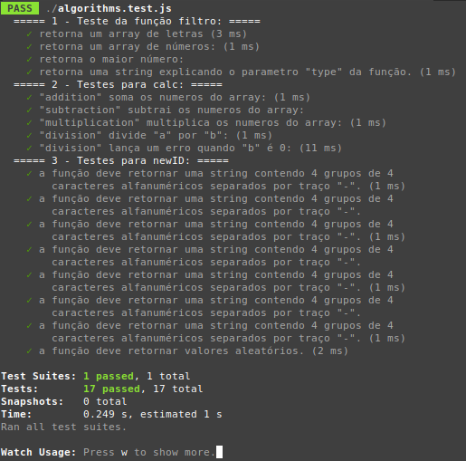

# Challenge for Lexartlabs - Algorithms and Data Structure

 

Project developed with Node an Jest.

To get the project run: `git clone git@github.com:gabrielrodriguesleite/algorithms_and_data_structure_challenge.git`

Go to the project folder: `cd algorithms_and_data_structure_challenge`

To install the dependencies run: `npm install`

To run project tests: `npm test`

---

## 1. Create an algorithm that runs through a one-dimensional array containing letters and numbers: [ “a”, 10, “b”, “hola”, 122, 15]

- a. Get an array containing just the letters
- b. Get an array containing just the numbers
- c. Get the highest number from the array above
  
## 2. Create a hashmap (or a simple object in PHP) that contains the elementary functions of addition, subtraction, multiplication, and division

- a. Take into account that the division must not allow 0 dividend
- b. The sum function allows an array as an input parameter and adds all its elements.
- c. The subtraction function allows an array as an input parameter and subtracts all its elements.
- d. Multiplication Function - Ditto
- e. The division function accepts two parameters: a and b.
  
## 3. Create an algorithm that generates the following random ID pattern: XXXX-AAAA-BBBB-CCCC

- a. Where XXXX, AAAA, BBBB and CCCC patterns are random alphanumeric
- b. The default is a string: "XXXX-AAAA-BBBB-CCCC"
- c. The result must be stored in a variable. For example:
  
  - i. $id = generarId()
  - ii. id is ~ abc1-bb12-234a-bcc2

---
